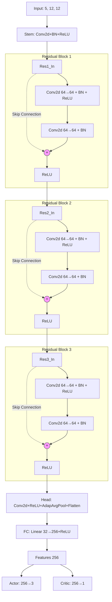

# Snake RL - Proximal Policy Optimization

The goal of this repository is to showcase a clean, minimal pipeline for training a Reinforcement Learning agent that masters the classic Snake game. The project is built around **[Gymnasium](https://gymnasium.farama.org/)** (for the game environment) and **[Stable-Baselines3](https://stable-baselines3.readthedocs.io/)** (for the RL algorithm).

It can be used as a **starting point** for:
- Testing different RL algorithms (DQN, SAC, A2C, …)
- Experimenting with reward shaping strategies
- Trying new network architectures
- Benchmarking performance improvements

---

## Installation & Execution

### 1. Install dependencies

```bash
pip install -r requirements.txt
```

### 2. Run `main.py`

`main.py` is the entry point for training, evaluation, and watching the agent play.

<div align="center">
  
| Flag | Description |
|------|-------------|
| `--train` | Train the agent from scratch (or resume from the best saved model) |
| `--eval`  | Evaluate the trained agent over 10,000 games and save scores to CSV |
| `--watch` | Load the trained agent and render it playing in a GUI window |
| `--checkpoint` | Load model checkpoint (required for `--eval` and `--watch`) |

</div>

```bash
# Train
python main.py --train # Optionally add --checkpoint <path>

# Evaluate (run after training)
python main.py --eval --checkpoint <path>

# Watch the agent play
python main.py --watch --checkpoint <path>
```

You can test my trained model (path: `./output/models/sb3_snake_ppo_best_TR1.zip`).

### 3. Output files

**After training:**
<div align="center">

| Path | Description |
|------|-------------|
| `output/models/sb3_snake_ppo_best.zip` | Final trained model |
| `output/models/sb3_checkpoints/` | Periodic model snapshots (every ~2M steps) |
| `output/plots/tensorboard/` | TensorBoard training logs |

</div>

**After evaluation (`--eval`):**
<div align="center">
  
| Path | Description |
|------|-------------|
| `output/csv/eval.csv` | Raw per-game scores (Game index, Score) |

</div>

### 4. Plot the score histogram

After running `--eval`, generate a score frequency histogram with:

```bash
python plot.py
```

Output: `output/plots/score_histogram_plot.png`

### 5. Monitor training with TensorBoard

All training metrics are logged to `output/plots/tensorboard/`. Launch TensorBoard with:

```bash
tensorboard --logdir output/plots/tensorboard/
```

Then open [http://localhost:6006](http://localhost:6006) in your browser. Key custom metrics are logged under the `snake/` namespace:

<div align="center">
  
| Metric | Description |
|--------|-------------|
| `snake/avg_score` | Average score over the last 1000 episodes |
| `snake/max_score` | Maximum score over the last 1000 episodes |
| `snake/win_rate`  | Fraction of episodes where the agent won (score = 97) |

</div>

---

## Implementation Details

### Algorithm

The agent uses **Proximal Policy Optimization (PPO)** via Stable-Baselines3, trained across **16 parallel environments** (`SubprocVecEnv`) for efficient data collection.

Key PPO hyperparameters:

<div align="center">

| Parameter | Value | Notes |
|-----------|-------|-------|
| `learning_rate` | `2.5e-4` | Constant |
| `n_steps` | `2048` | Steps per rollout per env |
| `batch_size` | `256` | Mini-batch size |
| `n_epochs` | `4` | Gradient epochs per rollout |
| `gamma` | `0.995` | Long discount horizon |
| `gae_lambda` | `0.95` | GAE smoothing |
| `clip_range` | `0.2` | PPO clip |
| `ent_coef` | `0.02` | Entropy bonus to prevent collapse |
| `total_timesteps` | `30,000,000` | Total training steps |

</div>

---

### State Space (Observation)

The board is 10×10 cells. A **1-cell border** is added on all sides, yielding a **12×12 grid**. The observation is a **5-channel tensor of shape (5, 12, 12)** — one channel per entity type:

<div align="center">

| Channel | Name | Description |
|---------|------|-------------|
| 0 | Walls | `1.0` on the 4 border rows/columns, `0.0` elsewhere |
| 1 | Head | `1.0` at the snake's head position |
| 2 | Body | Body cells with **ordering**: values decay linearly from `1.0` (segment closest to head) down to `~0.1` (tail tip), allowing the agent to infer snake length and shape |
| 3 | Food | `1.0` at the food position |
| 4 | Direction | Entire channel filled with a scalar encoding the current heading: `UP=0.25`, `RIGHT=0.50`, `DOWN=0.75`, `LEFT=1.00` |

</div>

This multi-channel design avoids ambiguity (walls and empty cells are distinct) and provides the agent with rich spatial information without needing frame stacking.

---

### Reward Function

<div align="center">
  
| Event | Reward | Notes |
|-------|--------|-------|
| Eat food | `+1.0` | Main learning signal |
| Death (wall or self) | `−1.0` | Terminal |
| Win (fill entire board) | `+100.0` | Terminal |
| Move closer to food | `+0.005` | Potential-based shaping |
| Move farther from food | `−0.005` | Potential-based shaping |
| Each step | `−0.001` | Small penalty to discourage looping |

</div>

> **Note:** Distance is measured in Manhattan distance (grid units). The shaping rewards use very small magnitudes to avoid dominating the sparse main signal.

---

### Neural Network Architecture

The feature extractor (`SnakeCNN` in `Model.py`) is a **ResNet-style CNN** that maps the `(5, 12, 12)` observation to a 256-dimensional feature vector, shared between the actor and critic heads.




---

## Results

*Coming soon.*
